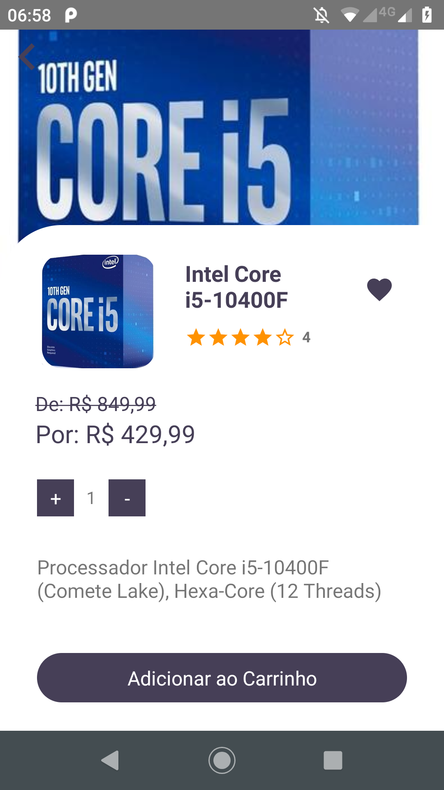
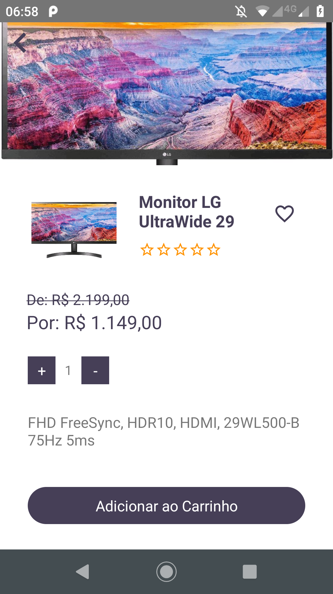

# **APP React Native PrimeTech E-commerce**
## **Escopo do produto**
O Projeto PrimeTech E-commerce consiste em um sistema web de comércio eletrônico que tem o intuito de comercializar produtos de informática. Todas as suas funcionalidades foram pensadas e elaboradas para proporcionar facilidade e comodidade aos usuários da plataforma.

O Aplicativo tem o objetivo de listar as categorias e seus respectivos produtos. Possibilitando ao cliente consultar, comprar e avaliar produtos.

O Aplicativo foi desenvolvido utilizando o React Native.
<br/>
<br/>

A API foi desenvolvida utilizando o NodeJs, ExpressJs e Banco de dados MongoDB. Foi realizada a integração com o PagSeguro e Correios. E está disponível para consulta no link abaixo:
```
https://github.com/danielbarbozadasilva/ecommerce-nodejs-api
```
<br/>

O Front-End foi desenvolvido utilizando o ReactJs em Javascript com layout responsivo, Material UI, Styled-components e Redux. E está disponível para consulta no link abaixo:

```
https://github.com/danielbarbozadasilva/ecommerce-frontend-react
```
<br/>

## **Instalação**
Clone o repositório na pasta de sua preferência.
```
git clone https://github.com/danielbarbozadasilva/ecommerce-react-native
```

Abra a pasta do repositório clonado, e crie um arquivo ".env", exemplo:
```
API_URL=http://192.168.0.14:3011/v1
API_URL_IMAGE=192.168.0.14
API_TOKEN_KEY=exemplo
```

Abra a pasta do repositório clonado, e instale as dependências do projeto através do comando:
```
yarn install
```

Execute o comando para rodar o projeto:
```
npx react-native run-android
```
<br/>

## **Requisitos funcionais**
<br/>

RF001 – O sistema deve controlar a autenticação do cliente.

RF002 – O sistema deve manter cadastro do cliente.

RF003 – O sistema deve consultar produtos.

RF004 – O sistema deve consultar categorias.

RF005 – O sistema deve favoritar produtos.

RF006 – O sistema deve controlar a venda de produtos.


<br/>
<br/>

## **Requisitos não funcionais**
<br/>

| Identificação | Classificação | Descrição |
| --- | --- | --- |
|RNF001   |Implementação     | O back-end do sistema deve ser desenvolvido em NodeJs e ExpressJs.    |
|RNF002   |Implementação     | O aplicativo deve ser desenvolvido utilizando o React native   |
|RNF003   |Implementação     | O banco de dados a ser utilizado é o MongoDB.     |
|  |  |  |

<br/>
<br/>

## **Regras de negócio**
<br/>

| Identificação | Classificação | Descrição |
| --- | --- | --- |
|RN001   |Recuperação de senha    | Para recuperar a senha, o Cliente deverá informar o token recebido por e-mail.     |
|RN002   |Controle de veracidade      | Para que um produto possa ser vendido, este deverá estar cadastrado no sistema.   |
|RN003   |Limite de ação     | Somente o Administrador terá permissão para incluir e alterar as categorias no sistema.    |
|RN004   |Limite de ação     | O Cliente poderá visualizar apenas os dados da sua conta. Tais como: solicitações, avaliações e histórico de compras.  |
|  |  |  |

<br/>
<br/>

> ## Licença
- Licença GPLv3
<br/>
<br/>
<br/>

> ## Metodologias e Padrões
* Conventional Commits
* Camelcase
* GitFlow
<br/>
<br/>
<br/>

> ## Bibliotecas e Ferramentas

* React hook form
* React native gesture handler
* React native masked text
* React native svg
* React native vector icons
* Yup
* React native swiper
* Native base
* Styled components
* Axios
* Git
* Eslint
* Prettier
* Redux-multi
* Redux-thunk
<br/>
<br/>
<br/>

> ## **Telas**
<br/>

## **Tela de carregamento**
<br/>

<br/>
<br/>
<br/>

## **Tela de login**
<br />
Para acessar o sistema, o cliente deve informar o e-mail e a senha corretamente, e clicar no botão "Logar".
<br />
<br />

<br />
<br />
<br />

## **Tela Criar conta**
<br />
Caso o usuário ainda não esteja cadastrado no sistema. Este deve clicar no botão "Cadastrar" para criar uma nova conta. Ao informar todos os campos de forma válida. Este deve clicar em "Cadastrar".
<br />
<br />
<div style="display: flex;">
    
    
</div>
<br />
<br />
<br />


## **Tela Recuperar senha**
Caso o usuário tenha esquecido sua senha, este deve clicar em "Recuperar senha". Na tela que vai se abrir, deve digitar seu e-mail e clicar no botão "Enviar".
<br />
<br />

<br />
<br />
<br />

## **Tela Recuperar senha**
<br />
Um e-mail será enviado com um token. Para redefinir a senha basta digitar o token recebido, o e-mail e a nova senha. Logo após o usuário deve clicar no botão "Recuperar".
<br />
<br />

<br />
<br />
<br />

## **Tela Home**
<br />
Na tela principal, o cliente terá acesso aos produtos. Este pode utilizar a barra de menu, para navegar através de produtos, categorias, carrinho, produtos favoritados e dados da conta.
<br />
<br />

<br />
<br />
<br />

## **Tela Home - Buscar**
<br />
Para buscar por um produto específico basta digitá-lo na barra de pesquisa.
<br />
<br />

<br />
<br />
<br />

## **Tela Produto - detalhes**
<br />
Nesta tela são exibidas as informações do produto. Assim como a opção de favoritá-lo.
<br />
<br />
<div style="display: flex;">
    
    
</div>
<br />
<br />
<br />

## **Tela Produtos favoritados**
<br />
Para acessar a tela de produtos favoritados basta clicar no icone em formato de "Coração" localizado no menu do aplicativo. 
<br />
<br />

<br />
<br />
<br />

## **Tela Categorias**
<br />
Para acessar a tela de categorias basta clicar no icone em formato de "Lista" localizado no menu do aplicativo. 
<br />
<br />

<br />
<br />
<br />

## **Tela Carrinho**
<br />
Para acessar a tela do carrinho basta clicar no icone em formato de "Carrinho de compras", localizado no centro do menu. 
Nesta tela será possivel remover o produto escolhido, assim como alterar a sua quantidade. Ao terminar o usuário deverá clicar no botão "Finalizar pedido".
<br />
<br />
<div style="display: flex;">


</div>
<br />
<br />

## **Tela Perfil**
<br />
Para acessar a tela de perfil basta clicar no icone em formato de "Pessoa" localizado no menu do aplicativo. Nesta tela o usuário poderá visualizar os seus pedidos, alterar os seus dados, visualizar regulamentos, avaliar o aplicativo, visualizar informações do aplicativo e finalizar a sessão.
<br />
<br />

<br />
<br />
<br />

## **Tela Perfil - Seus dados**
<br />
Nesta tela o usuário visualizará seus dados, com a possibilidade alterá-los.
<br />
<br />
<div style="display: flex;">
    
    
</div>
<br />
<br />
<br />